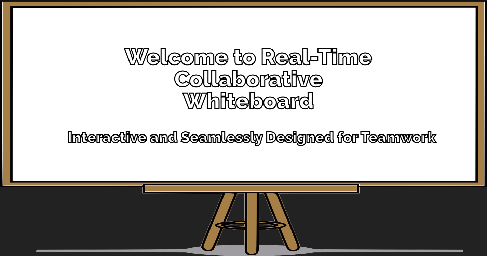
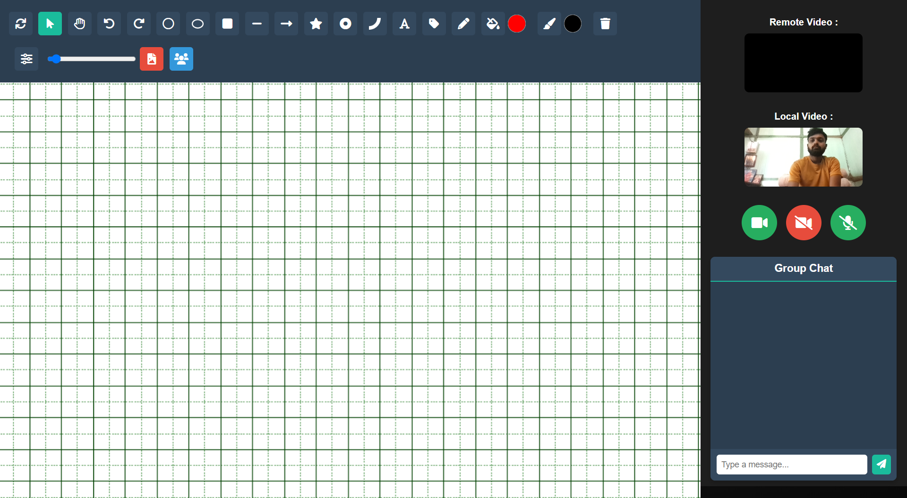
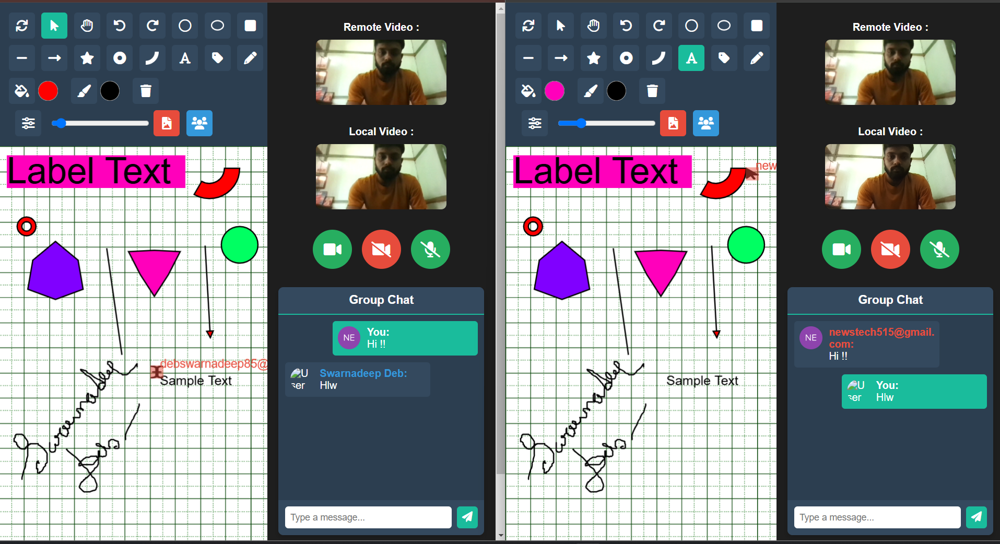

---


## Demo Video

<div align="center">
    <a href="https://youtu.be/dljldK3OzcM">
        
    </a>
</div>

## Overview

The **Collaborative Whiteboard** is a real-time, interactive drawing application designed for seamless collaboration among multiple users. Whether you're brainstorming ideas, conducting online meetings, or teaching remotely, this whiteboard allows users to draw shapes, write text, and share their canvas in real time. The app supports advanced real-time communication features such as group chats and video calls, making it a complete solution for online collaboration.

# Collaborative Whiteboard





## Key Features

### 1. **Real-time Collaboration**
   - Multiple users can draw on the same canvas simultaneously.
   - Users can join groups through unique room IDs to collaborate across different sessions.
   - Socket.io-based real-time synchronization of shapes, transformations, and actions.

### 2. **Shape and Text Tools**
   - Draw shapes such as circles, rectangles, ellipses, lines, and arrows.
   - Transformations: Scale and resize shapes in real-time with immediate updates for all users.

### 3. **Zoom and Pan**
   - Infinite zooming and panning for seamless navigation across large whiteboard canvases.

### 4. **Undo/Redo**
   - Efficient undo/redo functionality, synchronized in real-time across all users.

### 5. **Video Call Integration with Mediasoup SFU**
   - Built-in video call feature using a Single Forwarding Unit (SFU) architecture via Mediasoup, ensuring optimized video stream handling for all users in the room.
   - Admin controls for initiating and managing calls, and controlling user permissions within sessions.

### 6. **Group Chat**
   - Secure, socket-based group chat feature with user authentication via Auth0.
   - User avatars displayed beside messages, providing a personalized chat experience.

### 7. **Admin Controls**
   - Admins can manage users, control whiteboard permissions, initiate and end video calls, and kick users as needed.

## Tech Stack

### Frontend
- **React.js**: Building the interactive user interface.
- **Konva.js**: Canvas drawing and shape manipulation library for 2D transformations.
- **Socket.io**: Real-time communication for collaborative whiteboard updates.
- **Mediasoup**: SFU-based WebRTC framework for efficient, scalable video streaming.
- **Auth0**: Authentication for secure access to chat and video call functionalities.

### Backend
- **Node.js & Express.js**: Server-side logic, handling requests, and managing real-time events.
- **Socket.io**: Ensuring synchronized whiteboard updates across users.

## Project Setup

### Prerequisites
- [Node.js](https://nodejs.org/) (v14 or later)
- [Auth0 Account](https://auth0.com/)

### Installation

1. Clone the repository:
   ```bash
   git clone https://github.com/SwarnadeepDeb/collaborative-whiteboard.git
   ```
2. Navigate into the project directory:
   ```bash
   cd collaborative-whiteboard
   ```

3. Install the dependencies for both the backend and frontend:
   ```bash
   cd backend
   npm install
   cd ../frontend
   npm install
   ```

4. Set up environment variables:
   Create a `.env` file in the backend directory and add the following values:
   ```env
   AUTH0_CLIENT_ID=<your-auth0-client-id>
   AUTH0_CLIENT_SECRET=<your-auth0-client-secret>
   ```

5. Run the application:
   ```bash
   cd backend
   npm start
   cd ../frontend
   npm start
   ```

### Usage

- Visit `http://localhost:3000` in your browser.
- Users can create or join rooms using unique room IDs.
- Admin users can manage video calls, control drawing permissions, and monitor connected users.

## Contributions

This project is actively maintained, and contributions are welcome. Please feel free to open issues or submit pull requests for bug fixes, new features, or improvements.

## License

This project is licensed under the MIT License - see the [LICENSE](LICENSE) file for details.

---

## Contact

For any inquiries or collaboration opportunities, please contact me via email:

**Swarnadeep Deb**  
swarnadeepdebdevelopment@gmail.com

---
